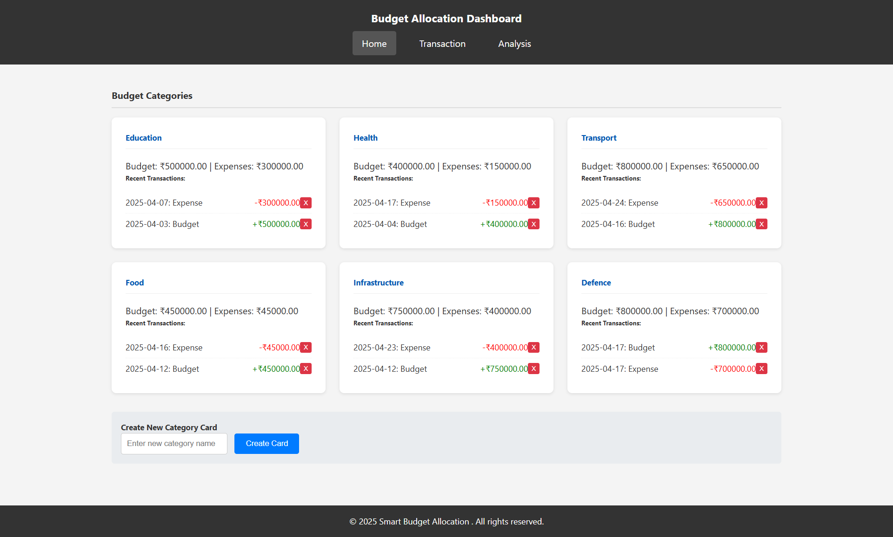
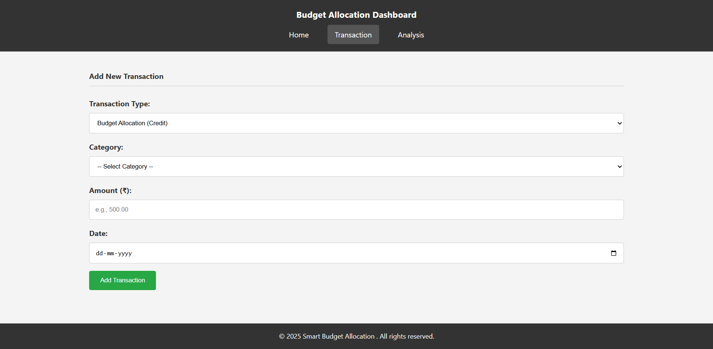
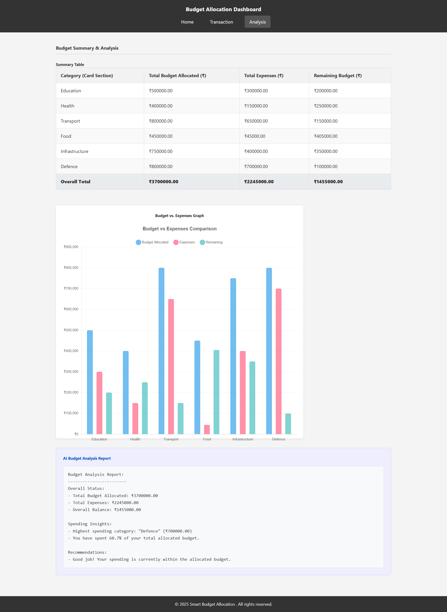

# HackGenX-Project
# 💡 Smart Budget Allocation System  

#### 👨‍💻 Team: `Tech_Ninjas`

---

## 📌 Problem Statement  
Design and develop a **Smart Budget Allocation System** that helps users manage and optimize their monthly income by categorizing expenses, tracking spending habits, and providing intelligent suggestions for savings and investments. The solution should be intuitive, secure, and user-friendly for both short-term and long-term financial planning.

---

## 🧠 Our Solution  
We built a **Smart Budget Allocation System** that allows users to:
- 🔐 Collect latest data: The system gathers current information from government and public sources.
- 📊 Split budget by sector: Funds are divided based on which areas need it most, like health or       education.
- 📂 Create reports automatically: The system makes helpful reports to support good decisions.
- 💰 Automatically allocate remaining funds into savings, emergency, and investment buckets  
- 📈 Get visual insights via graphs and pie charts  
- 🤖 Receive AI-powered tips to optimize spending habits

---

## 🛠️ Tech Stack  

| Frontend | Backend | 
|---------|---------|
| HTML, CSS, JavaScript  | Node.js  | 

---

## ⚙️ Features  
- ✅ Responsive User Interface  
- ✅ Monthly Income Input & Expense Tracking  
- ✅ Smart Allocation Algorithm (savings, investment, emergency)  
- ✅ Data Visualization with Charts   
- ✅ Personalized Budget Suggestions  
- ✅ Secure Cloud-based Data Storage

---

## 📷 Snapshots

